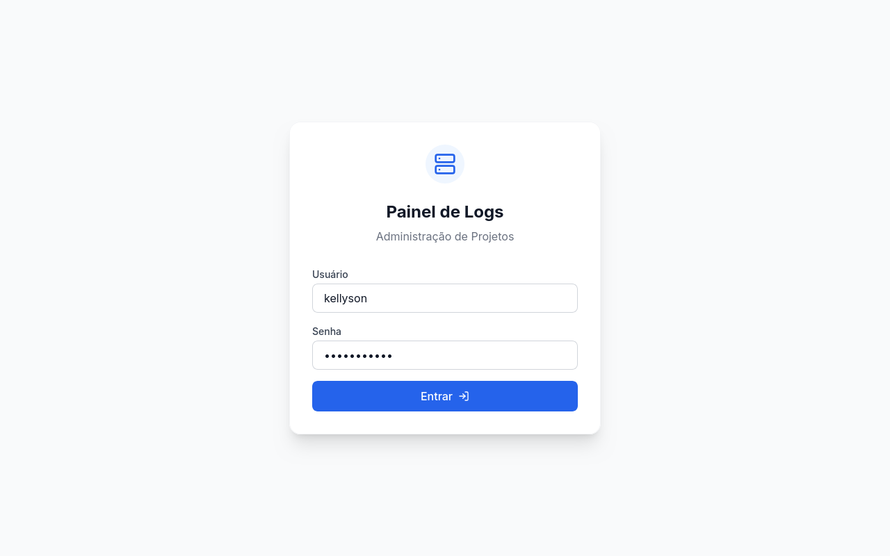
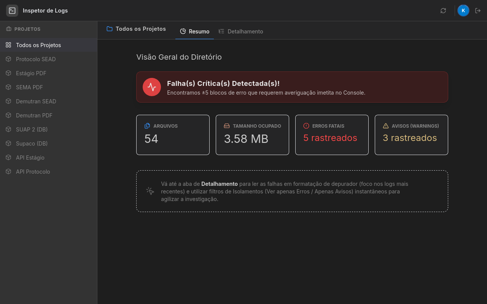
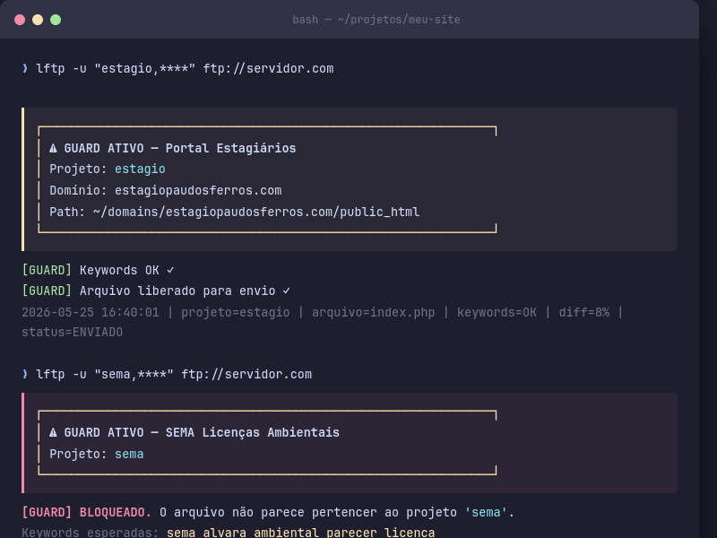
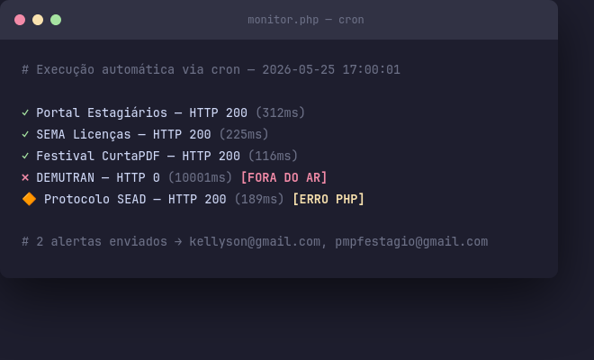

# PHP Deploy Guard

Central de segurança para projetos PHP hospedados em servidor compartilhado.

Resolve um problema clássico de equipes pequenas: **um deploy errado sobrescrevendo o projeto errado**. Adiciona uma camada de verificação antes de qualquer operação SSH ou FTP, monitora os sites automaticamente e facilita o desenvolvimento local com Docker.

| Login | Painel de logs |
|-------|---------------|
|  |  |





---

## O que faz

- **`guard.sh`** — intercepta `lftp`, `ssh` e `scp` automaticamente. Verifica se o arquivo que você está enviando pertence ao projeto de destino antes de deixar passar.
- **`local-env.sh`** — sobe qualquer projeto localmente com Docker em um comando.
- **`dump.sh`** — puxa o banco de produção via SSH e injeta no ambiente local.
- **`monitor.php`** (em `Logs/`) — verifica uptime e erros PHP nos sites, envia email de alerta.

---

## Estrutura

```
_infra/
├── projects.yml      # todos os projetos, domínios, keywords e configurações
├── guard.sh          # wrapper de segurança para SSH/FTP
├── local-env.sh      # gerenciador de ambiente Docker local
├── dump.sh           # sync de banco produção → local
└── README.md
```

---

## Setup

### 1. Dependência Python (leitura do projects.yml)

```bash
pip install pyyaml
```

### 2. Configurar os projetos

Edite `projects.yml` com seus projetos, domínios e credenciais. Cada projeto define:

```yaml
projects:
  meu-projeto:
    name: "Nome do Projeto"
    domain: meusite.com.br
    remote_path: ~/domains/meusite.com.br/public_html
    ftp_user: usuario_ftp
    db_name: nome_do_banco
    db_user: usuario_do_banco
    docker_port: 8090
    keywords:
      - palavra-chave-do-projeto
      - outra-palavra
```

As `keywords` são o coração da segurança: o guard verifica se o arquivo que você está enviando contém ao menos uma delas. Um arquivo sem nenhuma keyword do projeto é bloqueado.

### 3. Ativar os wrappers no Fish shell

Adicione ao `~/.config/fish/config.fish`:

```fish
set -g _GUARD "/caminho/para/_infra/guard.sh"
set -g _PROJETOS "/caminho/para/seus/projetos"

function lftp
    if string match -q "$_PROJETOS*" (pwd)
        bash $_GUARD lftp $argv
    else
        command lftp $argv
    end
end

function ssh
    if string match -q "$_PROJETOS*" (pwd)
        bash $_GUARD ssh $argv
    else
        command ssh $argv
    end
end

function scp
    if string match -q "$_PROJETOS*" (pwd)
        bash $_GUARD scp $argv
    else
        command scp $argv
    end
end
```

### 4. Tornar os scripts executáveis

```bash
chmod +x guard.sh local-env.sh dump.sh
```

---

## Como o guard funciona

Quando você roda `lftp`, `ssh` ou `scp` dentro do diretório de projetos:

```
1. Identifica o projeto pelo usuário FTP ou host SSH
2. Mostra um banner confirmando o destino
3. Para cada arquivo enviado:
   → Verifica se contém keywords do projeto
   → Se não contiver: BLOQUEIA e exige digitar o nome do projeto
   → Se diff com remoto > 40%: mostra o diff e pede confirmação
4. Registra tudo em logs/deploys_YYYY-MM.log
```

Exemplo de bloqueio:

```
┌──────────────────────────────────────────────────┐
│ ⚠  GUARD ATIVO — Portal Estagiários              │
│    Domínio:  estagiopaudosferros.com             │
│    Path:     ~/domains/.../public_html           │
└──────────────────────────────────────────────────┘

[GUARD] BLOQUEADO. O arquivo não parece pertencer ao projeto 'estagio'.
Digite o nome do projeto para confirmar:
```

---

## Uso diário

```bash
# Verificar um arquivo manualmente antes de enviar
./guard.sh check meu-projeto ./arquivo.php

# Git pull em produção com confirmação
./guard.sh pull meu-projeto

# Subir ambiente local
./local-env.sh start meu-projeto
./local-env.sh status
./local-env.sh stop meu-projeto

# Puxar banco de produção para local
./dump.sh meu-projeto
```

---

## Monitor de uptime

O `monitor.php` (instalado no servidor junto com o painel de logs) verifica:

- ✅ HTTP 200 — site OK
- 🔴 HTTP != 200 ou timeout — site fora do ar → email de alerta
- 🔶 HTTP 200 mas com `Fatal error` / `Parse error` no HTML — erro PHP → email de alerta

Configure no cron do servidor:

```
*/60 * * * * php ~/domains/seu-painel/public_html/monitor.php
```

Credenciais SMTP ficam em `.env` (nunca versionado):

```bash
# .env
SMTP_PASS=sua_senha
```

---

## Logs gerados

| Arquivo | Conteúdo |
|---------|---------|
| `logs/deploys_YYYY-MM.log` | Histórico completo de uploads e sessões SSH |
| `logs/uptime_YYYY-MM.log` | Resultado de cada verificação de uptime |
| `logs/alerts_YYYY-MM.log` | Registro de emails de alerta enviados |
| `logs/status.json` | Status atual dos domínios (consumido pelo painel web) |

---

## Requisitos

- Bash 4+
- Python 3 + pyyaml
- Docker (para `local-env.sh`)
- SSH com chave configurada no servidor
- PHP 8.0+ no servidor (para `monitor.php`)
- PHPMailer (`composer install` na pasta do painel)
